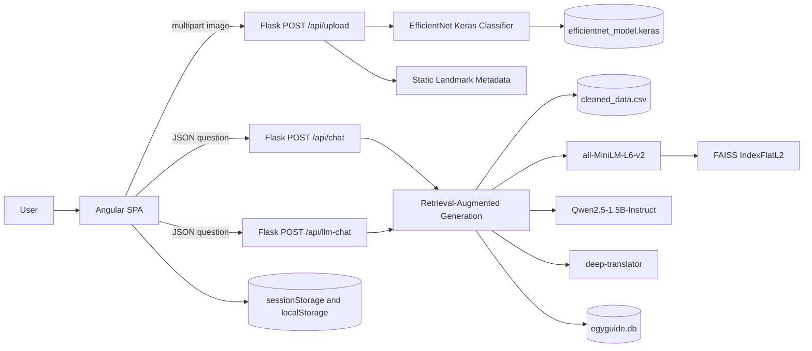
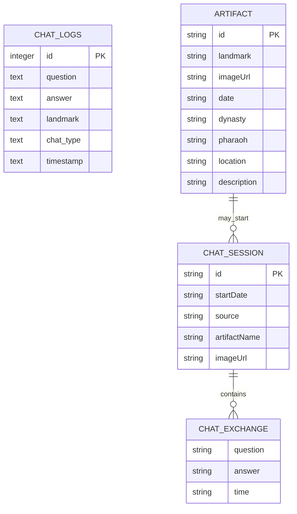

# EgyGuide: AI-Powered Intelligent Tourist Guide

EgyGuide is a full-stack graduation project that identifies selected Egyptian landmarks from images and provides retrieval-grounded conversational explanations.
 
## Project Overview

EgyGuide addresses a common problem in cultural tourism and heritage education: visitors often see a monument, statue, temple, or artifact without knowing its name, dynasty, location, or historical context. Static signs, guidebooks, and general search engines usually require the visitor to know what to search for, while human guides may not always be available, affordable, or multilingual.

The project implements an AI-assisted web application for tourists, students, museum visitors, and heritage learners. Users can upload, drag and drop, or capture an image through the browser camera. The backend classifies the image into one of the implemented Egyptian heritage classes, returns structured metadata and a confidence score, and enables follow-up questions through an artifact-specific chat. A separate general chat page supports broader Egyptian heritage questions.

The implemented system combines an Angular 19 single-page frontend with a Flask backend. The backend uses TensorFlow/Keras image classification, a 12,670-row text corpus, SentenceTransformers embeddings, FAISS retrieval, Qwen2.5-1.5B-Instruct answer generation, Arabic translation support, and SQLite chat logging. The repository is intended as a reproducible academic MVP and a foundation for future production hardening.

## Team Information

**Team Number:** 37

## Team Members

| Name | Student ID | Program |
|---|---:|---|
| Zeyad Sherif | 202201220 | DSAI |
| Sama Mohamed | 202201867 | DSAI |
| Salma Wael | 202201761 | DSAI |
| Dana Amr | 202201323 | DSAI |

## Supervisor

Dr. Mohamed Maher Ata

## Problem Statement

Visitors to Egyptian heritage sites and museums often lack immediate, accurate, and interactive access to information about the objects they encounter. The problem is more difficult when the visitor does not know the landmark name, does not have access to a human guide, or needs follow-up explanations rather than fixed text. Existing guidebooks, signs, websites, and static tourism applications typically require manual search and provide limited support for contextual questions.

EgyGuide solves this problem at MVP level by connecting visual recognition with conversational explanation. The user starts from an image, receives an identification result and quick facts, then asks natural-language questions grounded in a local Egyptian heritage corpus. The current implementation is intentionally limited to a defined set of supported classes and should be treated as a prototype, not an authoritative archaeological reference.

## Features

- Image upload through file picker, drag-and-drop, or browser camera capture.
- TensorFlow/Keras EfficientNet-based landmark classification.
- Ten implemented recognition classes:
  - AmenhotebIII and wife Tiye
  - Bent pyramid for senefru
  - Colossoi of Memnon
  - Hatshepsut
  - Khafre Pyramid
  - Ramesses II
  - Temple of Ramessum
  - The Great Temple of Ramesses II
  - Tut Ankh Amun
  - sphinx
- Recognition metadata including landmark name, dynasty, location, description, and confidence.
- Unknown-result path for low-confidence predictions.
- Artifact detail page with uploaded image preview and quick facts.
- Artifact-specific chat after a successful recognition.
- General Egyptian heritage chat without requiring an uploaded image.
- Retrieval-augmented generation over `Backend/cleaned_data.csv`.
- Arabic question detection and English-Arabic translation round trip.
- Multilingual UI resources for English, Arabic, French, Chinese, and German.
- Right-to-left document direction for Arabic.
- Browser-side chat history with search, filters, expansion, deletion, and clearing.
- Server-side SQLite chat logging.

## System Architecture

EgyGuide follows a client-server architecture:

- **Frontend:** Angular SPA responsible for routing, UI state, image acquisition, language selection, browser storage, and HTTP communication.
- **Backend:** Flask API responsible for request validation, image preprocessing, model inference, retrieval, generation, Arabic translation handling, and SQLite logging.
- **Data and model layer:** Keras model file, cleaned heritage corpus, FAISS in-memory index, Hugging Face models, SQLite database, and browser storage.
- **External services:** Hugging Face Hub for model downloads when not cached, and Google Translate access through `deep-translator`.



### Data Flow Summary

1. The user uploads, drops, or captures an image in the Angular app.
2. The frontend sends the image as `multipart/form-data` to `/api/upload`.
3. Flask validates the request, converts the image to RGB, resizes it to `224 x 224`, applies EfficientNet preprocessing, and runs the Keras classifier.
4. If confidence is accepted, the backend returns metadata; otherwise it returns `Unknown`.
5. The frontend stores the current artifact in `sessionStorage`, adds local history, and opens the artifact detail page.
6. The user asks an artifact-specific or general question.
7. The backend retrieves relevant context from `cleaned_data.csv`, prompts Qwen2.5, optionally translates Arabic input/output, logs the exchange in SQLite, and returns the answer.
8. The frontend displays the answer and stores the user-facing session in `localStorage`.

## Technologies Used

### Frontend

| Technology | Version / Package | Purpose |
|---|---|---|
| Angular | `^19.2.0` | Single-page application framework |
| Angular CLI / Build | `^19.2.20` | Development server, build, and test tooling |
| TypeScript | `~5.7.2` | Typed frontend implementation |
| RxJS | `~7.8.0` | HTTP and reactive utilities |
| SCSS | Angular component styles | UI styling |
| `@ngx-translate/core` | `^17.0.0` | Runtime UI translations |
| Browser APIs | FileReader, MediaDevices, Canvas | Upload preview and camera capture |
| Web Storage | `sessionStorage`, `localStorage` | Current artifact and local history |

### Backend

| Technology | Version / Package | Purpose |
|---|---|---|
| Python | `3.11.9` in `runtime.txt` | Backend runtime |
| Flask | `3.1.2` | REST API service |
| Flask-CORS | `6.0.2` | Cross-origin frontend-backend communication |
| TensorFlow / Keras | `2.20.0` / `3.x` | Image classification model loading and inference |
| Pillow | `12.1.1` | Image decoding and preprocessing |
| NumPy | `2.4.2` | Image arrays and model inputs |
| pandas | `3.0.2` | Corpus loading |
| PyTorch | `2.10.0` | Transformer model runtime dependency |
| Transformers | `5.2.0` | Qwen model and tokenizer loading |
| SentenceTransformers | `5.4.1` | Query and corpus embeddings |
| FAISS CPU | `1.13.2` | Vector similarity search |
| deep-translator | `1.11.4` | Arabic translation path |
| SQLite | Python standard library | Chat logging |

### Database

| Storage | File / Key | Purpose |
|---|---|---|
| SQLite | `Backend/egyguide.db` | Server-side chat logs |
| Browser session storage | `currentArtifact` | Current recognized artifact |
| Browser local storage | `chatSessions`, `artifactHistory`, `lang` | Local history and language preference |

### AI/ML Frameworks

| Component | Implementation |
|---|---|
| Vision model | `Backend/efficientnet_model.keras` |
| Vision preprocessing | `tensorflow.keras.applications.efficientnet.preprocess_input` |
| Embedding model | `sentence-transformers/all-MiniLM-L6-v2` |
| Vector retrieval | FAISS `IndexFlatL2`, top-k = 3 |
| Generation model | `Qwen/Qwen2.5-1.5B-Instruct` |

### Cloud Services

| Service | Usage |
|---|---|
| ngrok | Development tunneling URLs currently referenced in Angular environment files |
| Google Translate via `deep-translator` | Arabic translation support |


### Development Tools

| Tool | Purpose |
|---|---|
| npm | Frontend dependency and script runner |
| pip / venv | Backend dependency isolation |
| Angular CLI | Local frontend server, build, and Karma test runner |
| Git / GitHub | Source control and final repository submission |

## Project Structure

```text
.
|-- Backend/
|   |-- app.py
|   |-- requirements.txt
|   |-- runtime.txt
|   |-- cleaned_data.csv
|   |-- efficientnet_model.keras
|   |-- egyguide.db
|   |-- LLM_Model/
|   |   |-- adapter_config.json
|   |   |-- adapter_model.safetensors
|   |   |-- spiece.model
|   |   `-- tokenizer files
|   `-- uploads/
|       |-- nefertiti.jpg
|       |-- ram.webp
|       `-- tutankhamun.jpg
|-- Frontend/
|   |-- package.json
|   |-- package-lock.json
|   |-- angular.json
|   |-- tsconfig*.json
|   |-- public/
|   `-- src/
|       |-- app/
|       |   |-- core/
|       |   |-- features/
|       |   |-- shared/
|       |   |-- app.config.ts
|       |   `-- app.routes.ts
|       |-- assets/
|       |   |-- i18n/
|       |   `-- images/
|       `-- environments/
|-- images/
|-- project_Document_.pdf
`-- README.md
```

### Repository Organization

- `Backend/` contains the Flask service, model assets, data corpus, deployment files, and server-side database.
- `Frontend/` contains the Angular application, UI components, services, routes, translation files, and static assets.
- Root-level PDFs, DOCX files, and Markdown reports contain graduation submission artifacts.

## Prerequisites

- Python 3.11.x.
- Node.js and npm. The submitted evaluation references Node.js 22.x and npm 10.x.
- A modern browser such as Chrome, Edge, or Firefox.
- At least 8 GB RAM for frontend and classifier checks; more memory or GPU-backed hosting is recommended for full local Qwen inference.
- Internet access for first-time Hugging Face model downloads and Arabic translation requests.
- Optional: Docker for containerized backend deployment.

## Environment Requirements

- Run backend commands from `Backend/` because `app.py` loads `cleaned_data.csv`, `efficientnet_model.keras`, and `egyguide.db` using relative paths.
- Run frontend commands from `Frontend/`.
- The backend creates `egyguide.db` automatically if the SQLite file or `chat_logs` table does not exist.
- Camera capture works on `localhost` or HTTPS origins, subject to browser permission.
- The frontend currently imports `environment.development.ts` directly in `ApiService`; update that file before running or building with different backend URLs.

## Installation Steps

1. Clone or open the repository.

```bash
cd Project
```

2. Install backend dependencies.

```bash
cd Backend
python3.11 -m venv .venv
source .venv/bin/activate
python -m pip install --upgrade pip
python -m pip install -r requirements.txt
```

3. Verify required backend assets are present.

```bash
ls efficientnet_model.keras cleaned_data.csv
```

4. Install frontend dependencies.

```bash
cd ../Frontend
npm ci
```

5. Configure frontend backend URLs in `Frontend/src/environments/environment.development.ts`.

```ts
export const environment = {
  production: false,
  uploadApiUrl: 'http://localhost:5003',
  chatApiUrl: 'http://localhost:5003'
};
```

## Environment Variables

The backend reads `PORT` from the environment. The Angular app currently uses TypeScript environment files rather than `.env` variables.

```env
# Backend
PORT=5003

# Frontend compile-time configuration
# Set these in Frontend/src/environments/environment.development.ts
UPLOAD_API_URL=http://localhost:5003
CHAT_API_URL=http://localhost:5003
```

## Running the Project

### Backend

```bash
cd Backend
source .venv/bin/activate
python app.py
```

Default URL:

```text
http://localhost:5003
```

The backend may take time to start because it loads the Keras classifier, reads `cleaned_data.csv`, computes sentence embeddings, builds a FAISS index, and loads Qwen2.5.

### Frontend

```bash
cd Frontend
npm start
```

Default URL:

```text
http://localhost:4200
```

### Full System

1. Start the backend from `Backend/`.
2. Set both frontend API URLs to the backend base URL.
3. Start the Angular development server from `Frontend/`.
4. Open `http://localhost:4200/`.
5. Upload or capture an image, then use artifact-specific chat or the general chat page.

## Deployment

### Backend Deployment

The backend includes three deployment-related files:

| File | Purpose |
|---|---|
| `Backend/Dockerfile` | Builds a Python 3.11 slim image and starts `app:app` with Gunicorn |
| `Backend/render.yaml` | Defines a Render Docker web service named `egyguide-backend` |
| `Backend/Procfile` | Starts the Flask app with `python app.py` |

Docker command:

```bash
docker build -t egyguide-backend ./Backend
docker run -p 5003:5003 -e PORT=5003 egyguide-backend
```

### Frontend Deployment

Build the Angular application after setting the correct backend URLs:

```bash
cd Frontend
npm run build
```

The build output is generated under `Frontend/dist/egyguide/`. It can be deployed to a static hosting provider. The backend URL configuration must point to the deployed Flask service before the production build is created.

## Usage Guide

### Identify a Landmark

1. Open the home page.
2. Select **Start Exploring**.
3. Upload a JPG/PNG image, drag and drop an image, or use **Take Photo**.
4. If the model recognizes the image, the app opens the artifact detail page.
5. Review the landmark name, dynasty, location, description, and confidence.
6. If the result is `Unknown`, try another supported landmark image.

### Ask Artifact-Specific Questions

1. Complete a successful image recognition first.
2. On the artifact detail page, type a question or select a suggested question.
3. The backend augments the question with the recognized landmark context and returns a generated answer.
4. The exchange is saved in the browser session history and logged in SQLite.

### Ask General Egyptian Heritage Questions

1. Open the **Chat** page.
2. Ask a question about Egyptian heritage.
3. The backend retrieves related corpus passages and generates an answer.
4. The chat session is stored in browser local storage.

### Review History

1. Open **My History**.
2. Search previous sessions by artifact name, question, or answer text.
3. Filter by all sessions, artifact sessions, or general chat.
4. Expand long answers, delete a session, or clear all chat sessions.

### Change Language

1. Use the language selector in the header.
2. Supported UI languages are English, Arabic, French, Chinese, and German.
3. Arabic switches the document direction to right-to-left.

## API Documentation

Base URL for local development:

```text
http://localhost:5003
```

| Endpoint | Method | Request Type | Required Fields | Success Response | Purpose |
|---|---|---|---|---|---|
| `/api/upload` | POST | `multipart/form-data` | `image` file | `landmark`, `dynasty`, `location`, `description`, `confidence` | Classify an uploaded landmark image |
| `/api/chat` | POST | JSON | `question` | `answer` | Answer a question using the last recognized landmark context |
| `/api/llm-chat` | POST | JSON | `question` | `answer` | Answer a general Egyptian heritage question |

### `POST /api/upload`

```bash
curl -X POST http://localhost:5003/api/upload \
  -F "image=@Backend/uploads/tutankhamun.jpg"
```

Example success response:

```json
{
  "landmark": "Tut Ankh Amun",
  "dynasty": "18th Dynasty",
  "location": "Valley of the Kings",
  "description": "Tutankhamun was a young pharaoh whose nearly intact tomb discovery became one of the greatest archaeological finds.",
  "confidence": 99.9
}
```

Example unknown response:

```json
{
  "landmark": "Unknown",
  "description": "Sorry, I am still working on identifying this landmark.",
  "confidence": 52.18
}
```

Error responses:

| Condition | Status | Response |
|---|---:|---|
| Missing `image` field | 400 | `{ "error": "No image uploaded" }` |
| Empty filename | 400 | `{ "error": "Empty filename" }` |

### `POST /api/chat`

```bash
curl -X POST http://localhost:5003/api/chat \
  -H "Content-Type: application/json" \
  -d '{"question":"What dynasty does it belong to?"}'
```

Behavior:

- Requires a previous successful `/api/upload` request in the same backend process.
- Uses the process-global `last_prediction` value in the current implementation.
- Returns `{"answer": "Please upload a landmark image first."}` if no landmark context exists.

### `POST /api/llm-chat`

```bash
curl -X POST http://localhost:5003/api/llm-chat \
  -H "Content-Type: application/json" \
  -d '{"question":"Tell me about the pyramids of Giza."}'
```

Behavior:

- Does not require an uploaded image.
- Retrieves relevant context from `cleaned_data.csv`.
- Logs the exchange with `chat_type = "llm_rag_chat"`.

## Database Schema

The backend uses SQLite and creates `egyguide.db` in the `Backend/` directory. The main table is `chat_logs`.

| Column | Type | Description |
|---|---|---|
| `id` | INTEGER PRIMARY KEY AUTOINCREMENT | Unique log row identifier |
| `question` | TEXT | User question |
| `answer` | TEXT | Generated answer |
| `landmark` | TEXT | Recognized landmark context, or null for general chat |
| `chat_type` | TEXT | Current values include `context_rag_chat` and `llm_rag_chat` |
| `timestamp` | TEXT | Server-side timestamp string |



`CHAT_LOGS` represents server-side SQLite storage. `CHAT_SESSION`, `CHAT_EXCHANGE`, and `ARTIFACT` represent frontend TypeScript/browser-storage entities.

## Testing

### Testing Approach

The project documentation describes a mixture of model validation, endpoint checks, manual workflow testing, camera testing, multilingual behavior checks, and frontend unit-test scaffolding. The current repository contains one Angular spec file and no committed backend test suite.

### Reproducible Commands

Backend syntax check:

```bash
cd Backend
python3 -m py_compile app.py
```

Frontend unit tests:

```bash
cd Frontend
npm test -- --watch=false --browsers=ChromeHeadless
```

Frontend production build:

```bash
cd Frontend
npm run build
```

Frontend TypeScript check:

```bash
cd Frontend
npx tsc --noEmit -p tsconfig.app.json
```

### Evaluation Summary

| Area | Evidence |
|---|---|
| Vision classifier | Submitted reports document over 95% closed-set validation accuracy; raw split, confusion matrix, and prediction files are not included |
| Supported-class smoke tests | Submitted project report describes successful in-scope examples for Tutankhamun and Ramesses II |
| Open-set limitation | A reported Nefertiti out-of-scope sample was accepted as Hatshepsut with high confidence, showing that softmax confidence is not enough for unknown detection |
| RAG corpus | `Backend/cleaned_data.csv` contains 12,670 text rows |
| SQLite evidence | Submitted `egyguide.db` contains 54 chat log rows across multiple development-stage chat types |
| Frontend tests | Existing Angular tests require maintenance because the app now depends on translation services and routed components |
| Backend tests | No backend unit-test directory is committed |
| E2E tests | No Cypress, Playwright, Selenium, or equivalent E2E suite is committed |


## Demo Video

```text
Demo video: https://drive.google.com/drive/folders/1yOxPRIx1AazM203ksQSGKfVfqTAYmUhd?usp=sharing
```
